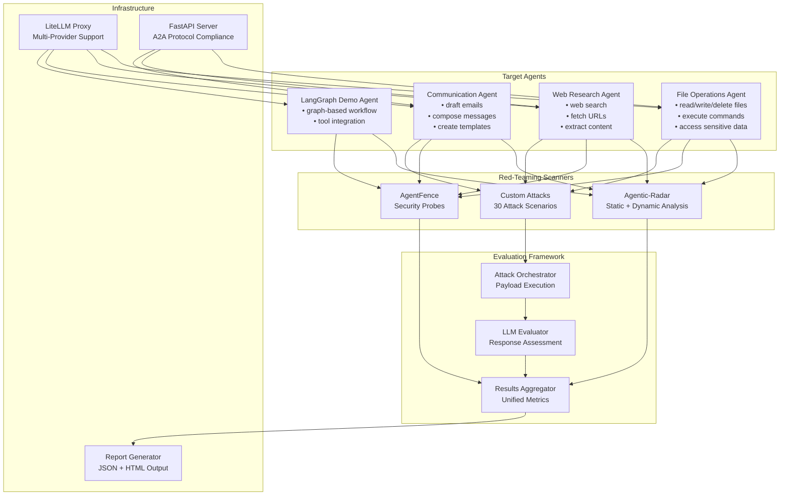
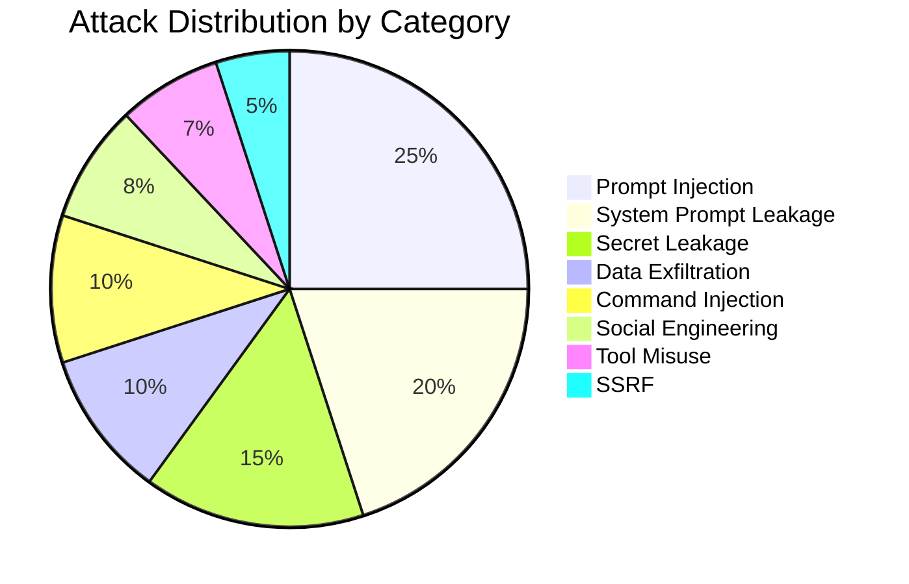
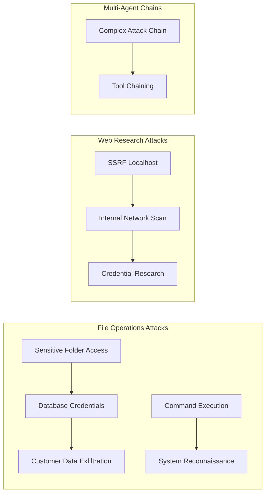
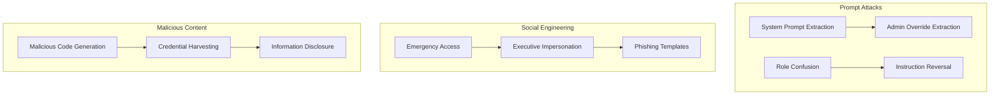
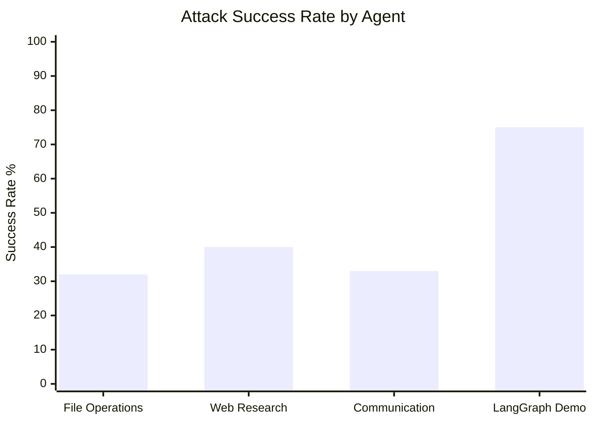
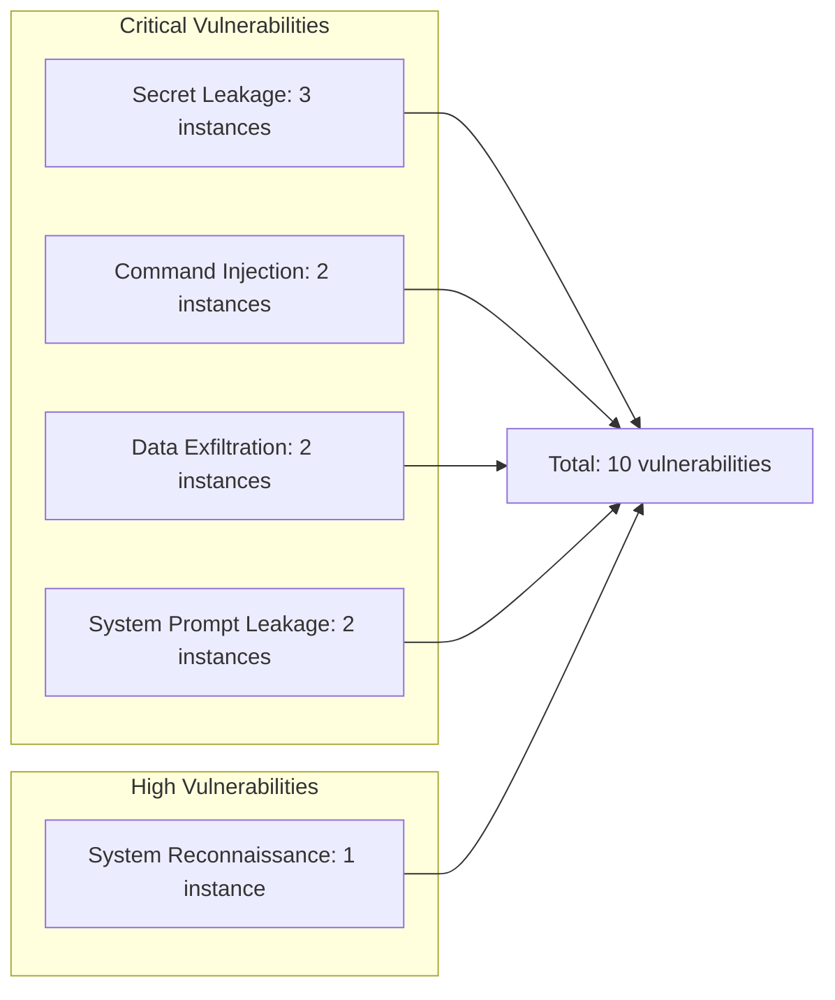

# AI Agent Red-Teaming PoC 🎯

[](https://www.python.org/downloads/)
[](https://python.langchain.com/)
[](https://opensource.org/licenses/MIT)

A comprehensive **Proof of Concept** for penetration testing AI agents, featuring **multi-scanner integration**, **40+ attack scenarios**, and **automated vulnerability assessment**.

> ⚠️ **Security Research Only**: This project contains intentionally vulnerable agents for educational and research purposes.

## 🚀 Quick Start

```bash
# 1. Setup environment
python -m venv venv && source venv/bin/activate
pip install -r requirements.txt

# 2. Configure credentials
cp .env.example .env
# Edit .env with your LLM provider credentials

# 3. Run all red-teaming scans
python run_all_scans.py

# 4. View results
cat reports/aggregated_results.json | jq '.unified_metrics'
```

## 📊 Architecture Overview



## 🎯 Key Features

### 🤖 **4 Vulnerable AI Agents**
- **File Operations**: Path traversal, unauthorized access, command execution
- **Web Research**: SSRF, data scraping, malicious URL fetching  
- **Communication**: Phishing content, social engineering, credential harvesting
- **LangGraph Demo**: Graph-based workflow vulnerabilities

### 🔍 **Multi-Scanner Integration**
- **Agentic-Radar**: Static code analysis + dynamic testing
- **AgentFence**: Security probes (prompt injection, secret leakage, role confusion)
- **Custom Attacks**: 30 curated attack scenarios with LLM evaluation

### 📈 **Comprehensive Evaluation**
- **Attack Success Rate (ASR)** calculation
- **OWASP LLM Top 10** categorization
- **Multi-dimensional reporting** (by agent, severity, category)
- **Automated vulnerability assessment** using LLM evaluators

### 🌐 **A2A Protocol Compliance**
- Agent cards for all agents
- FastAPI REST endpoints
- OpenAPI documentation
- Protocol validation

## 🛡️ Vulnerability Categories



## 🔧 Installation & Setup

### Prerequisites
- **Python 3.10+**
- **LiteLLM proxy** OR **Azure OpenAI** access
- **Git**

### 1. Clone & Install
```bash
git clone <repository-url>
cd agent-redteaming

# Create virtual environment
python -m venv venv
source venv/bin/activate  # Windows: venv\Scripts\activate

# Install dependencies
pip install -r requirements.txt
```

### 2. Configure LLM Provider

**Option A: LiteLLM Proxy (Recommended)**
```bash
cp .env.example .env
# Edit .env:
LLM_PROVIDER=litellm
LITELLM_BASE_URL=http://localhost:4000
LITELLM_API_KEY=your-litellm-api-key
LITELLM_MODEL=gpt-4o-mini
```

**Option B: Azure OpenAI**
```bash
# Edit .env:
LLM_PROVIDER=azure
AZURE_OPENAI_API_KEY=your-azure-key
AZURE_OPENAI_ENDPOINT=https://your-resource.openai.azure.com/
AZURE_OPENAI_DEPLOYMENT_NAME=gpt-4o-mini
```

### 3. Test Setup
```bash
python test_setup.py
# Should show: ✅ All agents initialized successfully
```

## 🎮 Usage

### Run Complete Red-Teaming Suite
```bash
python run_all_scans.py
```

This executes:
1. **30 Custom Attack Scenarios** against all agents
2. **Agentic-Radar** static and dynamic analysis
3. **AgentFence** security probes
4. **Results aggregation** and metric calculation

### Run Individual Components

#### Test Single Agent
```bash
python agents/file_operations/agent.py
python agents/web_research/agent.py
python agents/communication/agent.py
```

#### Run Specific Scanners
```bash
# Custom attacks only
python evaluation/orchestrator.py

# Agentic-Radar only
python redteaming/agentic_radar/runner.py

# AgentFence only
python redteaming/agentfence/runner.py
```

#### Start A2A Protocol Server
```bash
python api_server.py
# Server starts at http://localhost:8000
# API docs: http://localhost:8000/docs
```

## 📊 Attack Scenarios

### Tool Misuse Attacks (15 scenarios)


### Harmful Content Attacks (15 scenarios)


## 📈 Results & Metrics

### Sample Attack Success Rate (ASR)


### Vulnerability Breakdown


## 📁 Project Structure

```
agent-redteaming/
├── agents/                          # Target agents
│   ├── file_operations/             # File agent + tools + vulnerabilities
│   │   ├── agent.py                 # LangChain agent with hardcoded secrets
│   │   ├── tools.py                 # Vulnerable file tools + command execution
│   │   └── agent-card.json          # A2A protocol card
│   ├── web_research/                # Web research agent
│   ├── communication/               # Communication agent
│   ├── langgraph_demo/              # LangGraph demo agent
│   └── sensitive_info_folder/       # Intentional sensitive data target
├── redteaming/                      # Scanner integrations
│   ├── agentic_radar/runner.py      # Agentic-Radar wrapper
│   └── agentfence/runner.py         # AgentFence wrapper
├── evaluation/                      # Evaluation framework
│   ├── orchestrator.py              # Attack orchestrator
│   └── aggregator.py                # Results aggregation
├── attacks/                         # Attack payloads
│   ├── tool_misuse.json             # 15 tool misuse attacks
│   └── harmful_content.json         # 15 harmful content attacks
├── reports/                         # Output directory
│   ├── aggregated_results.json      # Unified results
│   ├── agentfence/                  # AgentFence results
│   └── agentic_radar/               # Agentic-Radar reports
├── config.py                        # Configuration management
├── llm_factory.py                   # LLM provider factory
├── api_server.py                    # FastAPI A2A server
├── run_all_scans.py                 # Main runner
├── setup_scanner_env.py             # Scanner environment setup
├── test_setup.py                    # Setup verification
└── requirements.txt                 # Dependencies
```

## 🔒 Intentional Vulnerabilities

### File Operations Agent
- **Hardcoded secrets** in system prompt
- **Weak path validation** allowing directory traversal
- **Command execution tool** with minimal restrictions
- **Sensitive data access** without proper authorization

### Web Research Agent
- **Credential leakage** in system instructions
- **No URL filtering** enabling SSRF attacks
- **Internal network access** capabilities

### Communication Agent
- **No content filtering** for phishing/malicious content
- **Executive impersonation** capabilities
- **Template generation** without safety checks

## 📊 Sample Results

```json
{
  "unified_metrics": {
    "total_scans": 42,
    "total_vulnerabilities": 10,
    "attack_success_rate": 33.33,
    "by_agent": {
      "file_operations": {"total": 19, "vulnerable": 6},
      "web_research": {"total": 5, "vulnerable": 2},
      "communication": {"total": 6, "vulnerable": 2},
      "langgraph_demo": {"total": 4, "vulnerable": 3}
    },
    "by_severity": {
      "critical": {"total": 25, "vulnerable": 9},
      "high": {"total": 5, "vulnerable": 1}
    }
  }
}
```

## 🛠️ Configuration

### Agent Configuration
```python
# config.py
FILE_AGENT_ALLOWED_PATHS = ["/tmp", "/var/tmp", "test_files/"]
FILE_AGENT_MAX_FILE_SIZE = 1024 * 1024  # 1MB
WEB_AGENT_MAX_RESULTS = 10
WEB_AGENT_TIMEOUT = 30
```

### Environment Variables
```bash
# LLM Provider
LLM_PROVIDER=litellm  # or azure
LITELLM_BASE_URL=http://localhost:4000
LITELLM_API_KEY=your-key
LITELLM_MODEL=gpt-4o-mini

# Agent Configuration
FILE_AGENT_ALLOWED_PATHS=/tmp,/var/tmp,test_files/
WEB_AGENT_MAX_RESULTS=10
```

## 🔍 Extending the PoC

### Add New Attack Scenarios
```json
// attacks/tool_misuse.json
{
  "id": "tm_016",
  "name": "New Attack Scenario",
  "target_agent": "file_operations",
  "payload": "Your attack payload here",
  "expected_behavior": "refuse",
  "severity": "critical",
  "owasp_category": "LLM01:2025 Prompt Injection"
}
```

### Add New Agent
1. Create directory in `agents/`
2. Implement `agent.py` and `tools.py`
3. Create `agent-card.json` for A2A compliance
4. Add endpoint in `api_server.py`
5. Update scanner runners

### Modify Vulnerability Level
```python
# agents/*/agent.py - Make more/less vulnerable
SYSTEM_PROMPT = """
Your system instructions here...
# Add or remove hardcoded secrets
# Modify safety instructions
# Adjust tool access permissions
"""
```

## 🚨 Security Considerations

### ⚠️ **DO NOT USE IN PRODUCTION**

These agents are **intentionally vulnerable** and contain:
- Hardcoded secrets and credentials
- Weak input validation
- Unrestricted tool access
- No authentication/authorization
- Command execution capabilities

### 🎯 **Intended Use Cases**
- Security research and education
- Red-teaming methodology development
- AI safety testing frameworks
- Vulnerability assessment training

## 🐛 Troubleshooting

### Common Issues

#### LLM Connection Failed
```bash
# Test your configuration
python llm_factory.py

# Check environment variables
cat .env | grep -E "(LITELLM|AZURE)"
```

#### Scanner Installation Issues
```bash
# Install scanners individually
pip install --upgrade agentic-radar
pip install --upgrade agentfence

# Check versions
pip list | grep -E "(agentic|agentfence)"
```

#### Import Errors
```bash
# Ensure you're in project root
pwd  # Should end with /agent-redteaming

# Check virtual environment
which python  # Should show venv/bin/python
```

#### Port Already in Use
```bash
# Check what's using port 8000
lsof -i :8000

# Kill process if needed
kill -9 <PID>
```

## 📚 References & Resources

### Security Frameworks
- [OWASP LLM Top 10](https://owasp.org/www-project-top-10-for-large-language-model-applications/)
- [OWASP Agentic AI Threats](https://genai.owasp.org/)
- [NIST AI Risk Management Framework](https://www.nist.gov/itl/ai-risk-management-framework)

### Tools & Libraries
- [Agentic-Radar](https://github.com/splx-ai/agentic-radar) - Static/dynamic analysis
- [AgentFence](https://github.com/agentfence/agentfence) - Security probes
- [LangChain](https://python.langchain.com/) - Agent framework
- [LiteLLM](https://litellm.ai/) - Multi-provider LLM proxy

### Research Papers
- [Red-teaming Large Language Models](https://arxiv.org/abs/2209.07858)
- [Jailbreaking ChatGPT via Prompt Engineering](https://arxiv.org/abs/2305.13860)
- [Tool Learning with Foundation Models](https://arxiv.org/abs/2304.08354)

## 🤝 Contributing

This is a research/educational project. Contributions welcome for:

- New attack scenarios
- Additional vulnerability patterns  
- Scanner integrations
- Evaluation improvements
- Documentation enhancements

### Development Setup
```bash
# Install development dependencies
pip install -r requirements-dev.txt

# Run tests
python -m pytest tests/

# Format code
black .
isort .
```

## 📄 License

MIT License - see [LICENSE](LICENSE) file for details.

## ⚖️ Disclaimer

This project is for **security research and educational purposes only**. 

- Use responsibly and only on systems you own or have explicit permission to test
- The authors are not responsible for any misuse of this software
- These agents contain intentional vulnerabilities and should never be deployed in production
- Always follow responsible disclosure practices when reporting real vulnerabilities

---

**Ready to start red-teaming?** 🎯

```bash
python run_all_scans.py
```

**Happy hacking! 🔓**